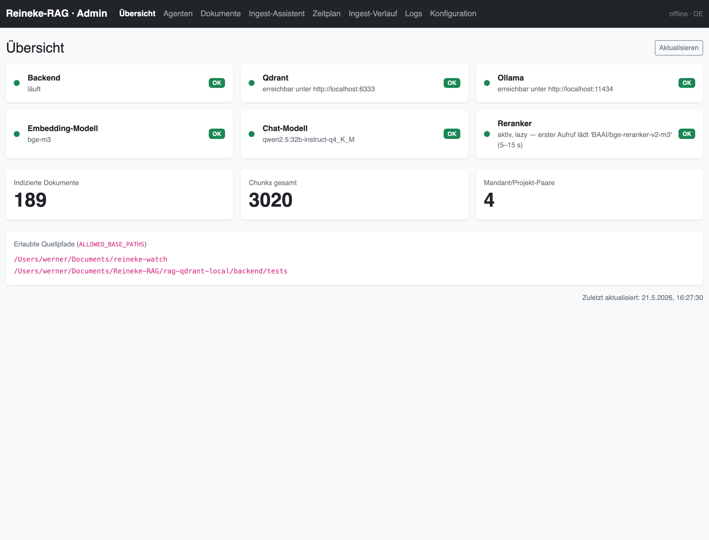
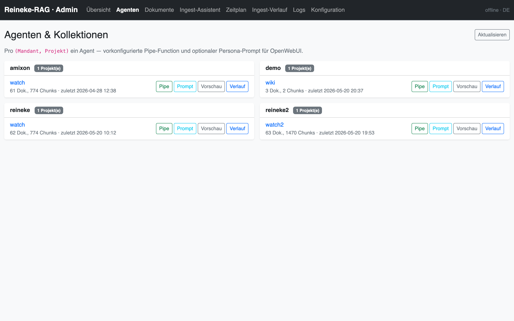
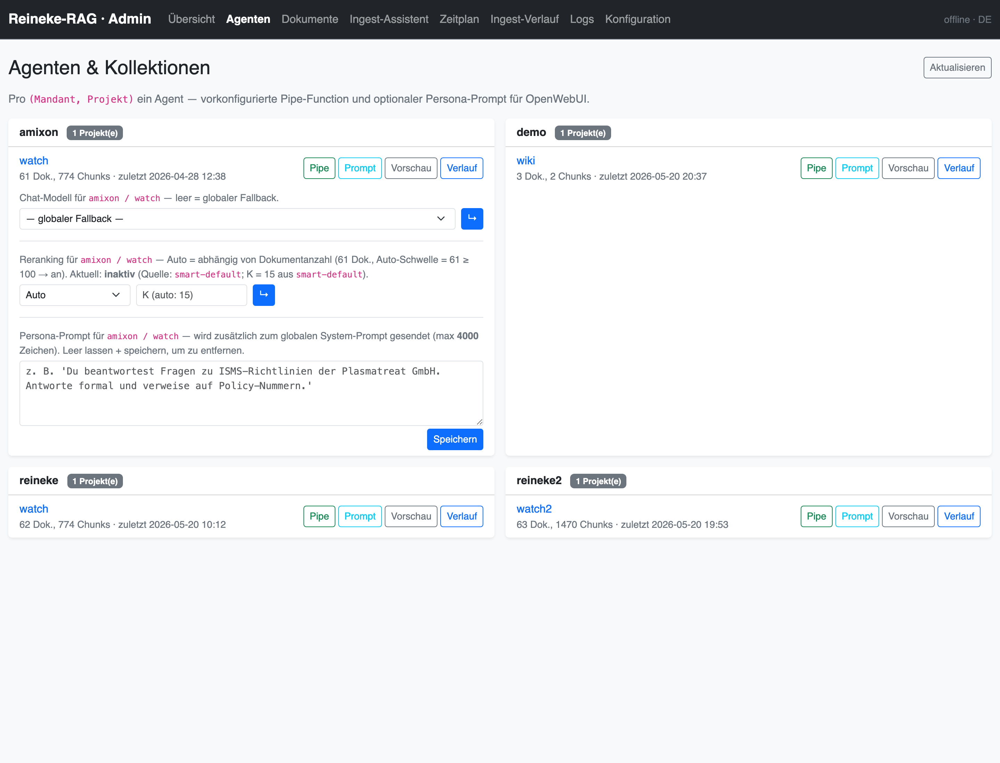
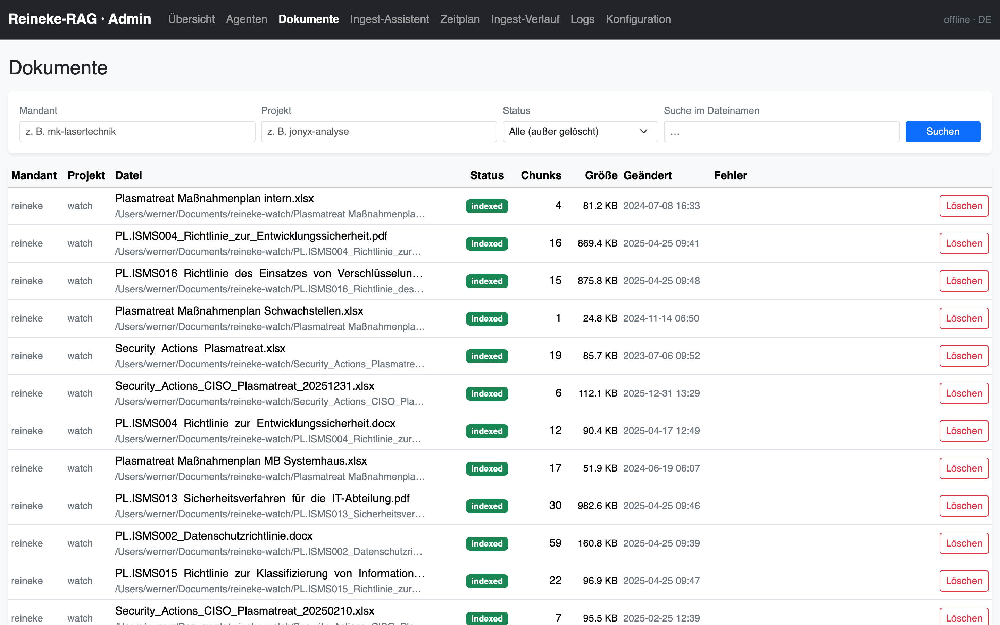
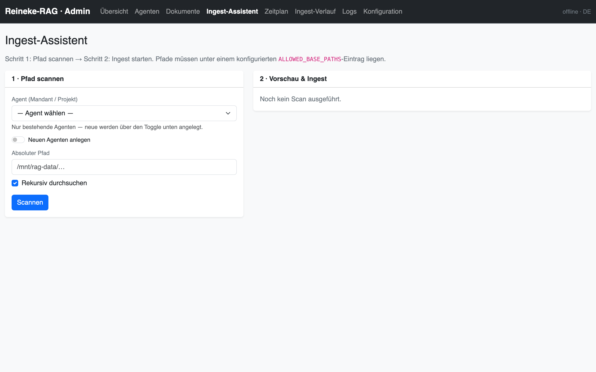
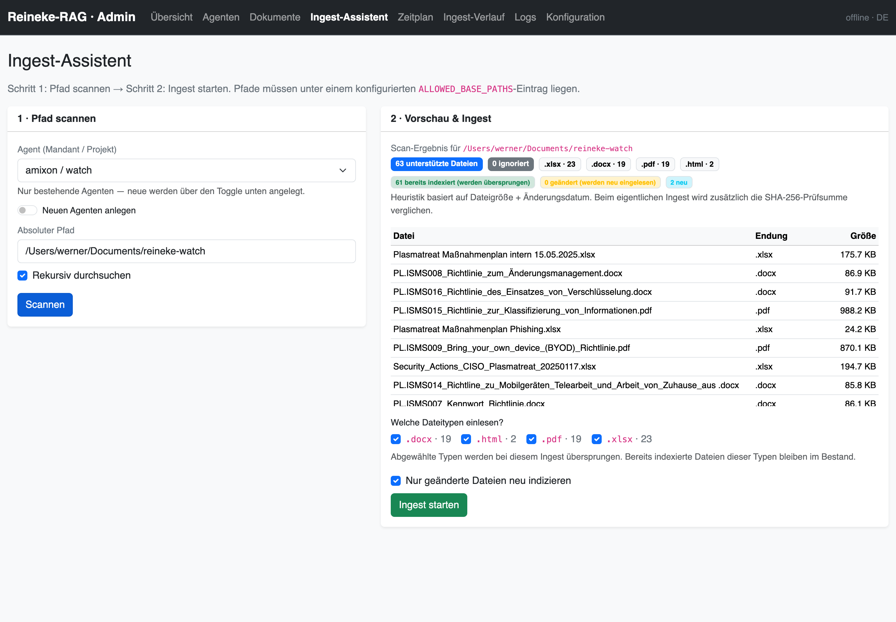
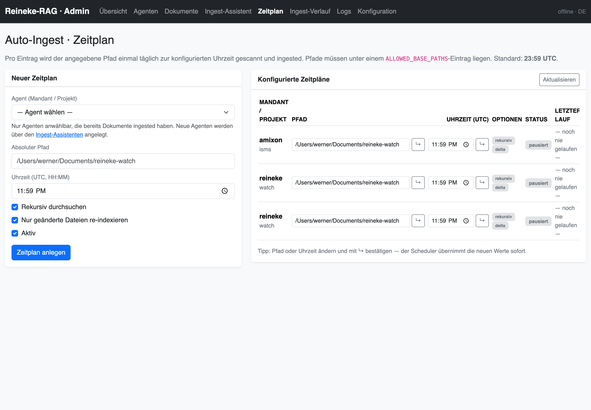
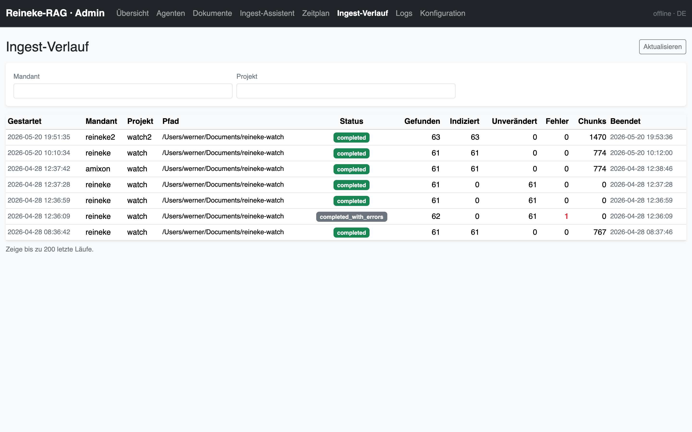
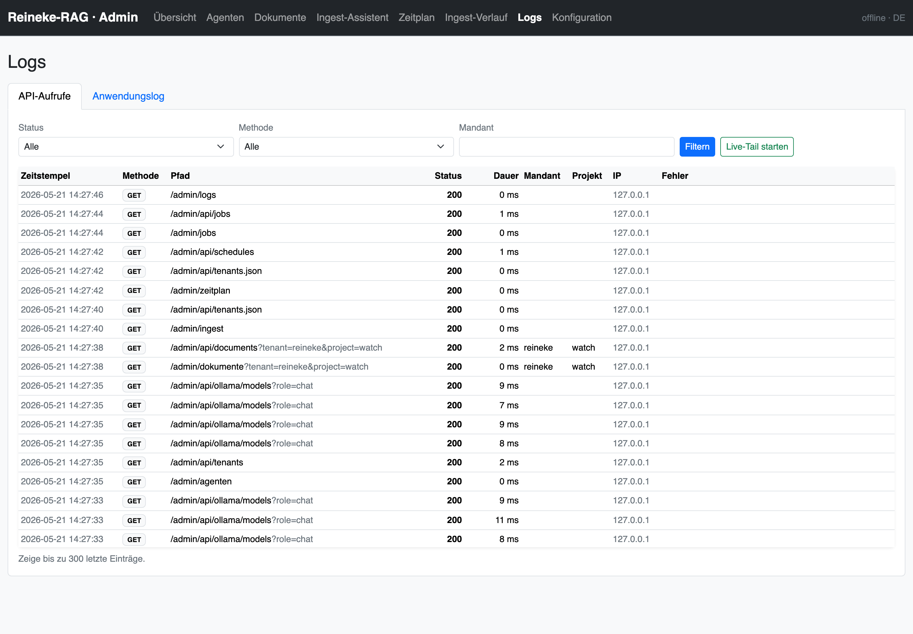
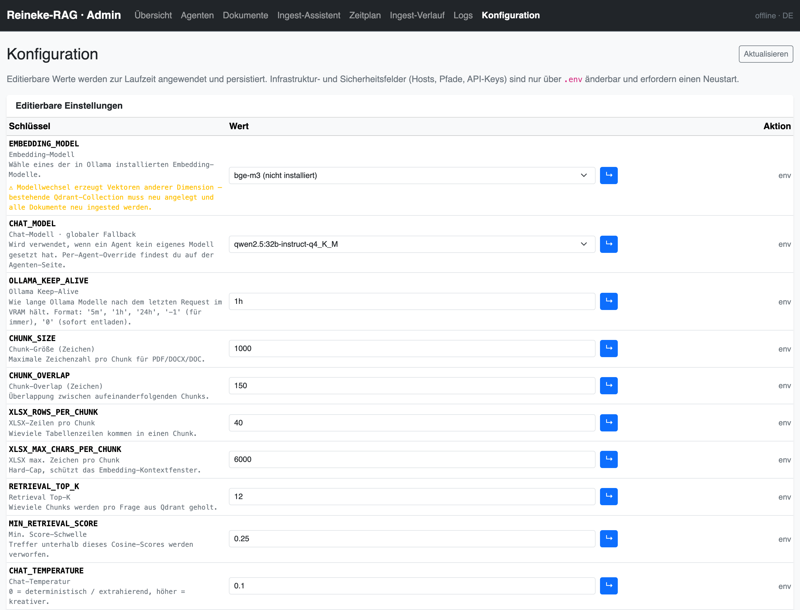

# 1 · Worum geht es?

Dieses Handbuch beschreibt die tägliche Arbeit mit dem **Admin-Web-UI** von
Reineke-RAG. Es richtet sich an Anwenderinnen und Anwender, die

* neue Dokumenten-Quellen indexieren,
* den Bestand pflegen (löschen, reindizieren),
* Agenten mit individuellem Persona-Prompt einrichten,
* nächtliche Auto-Ingest-Läufe konfigurieren,
* Konfigurations­werte anpassen oder
* Logs und Fehler nachverfolgen wollen.

Das Admin-UI ist ein normales Bootstrap-Web-Interface, läuft direkt im Backend
und benötigt keine zusätzliche Anwendung. Aufruf:

```
http://<server>:8000/admin/
```

Voraussetzung: Das Backend läuft, der Server ist im internen Netz erreichbar.
Für die nachfolgenden Screenshots wurde die Standard-Adresse
`http://localhost:8000/admin/` verwendet.

> **Hinweis zur Authentifizierung.** Das Admin-UI hat selbst keine Anmeldung —
> es lebt im Vertrauens­modell „intern erreichbar, Reverse-Proxy übernimmt
> ggf. TLS und SSO". Stelle sicher, dass das Backend **nicht** öffentlich
> erreichbar ist.

---

# 2 · Erster Blick — die Übersicht

Nach dem Öffnen landet man auf der **Übersicht**. Sie zeigt die wichtigsten
Statusinformationen auf einen Blick:



Sechs grüne Status-Kacheln signalisieren, dass alle Komponenten erreichbar
und betriebs­bereit sind:

| Kachel | Inhalt |
|---|---|
| **Backend** | Reineke-RAG selbst — läuft, wenn die Seite überhaupt sichtbar ist |
| **Qdrant** | Vektor-Datenbank, üblicher­weise unter `:6333` |
| **Ollama** | Lokale LLM-Runtime, üblicher­weise unter `:11434` |
| **Embedding-Modell** | Das in `.env` (oder Konfiguration) ausgewählte Embedding-Modell |
| **Chat-Modell** | Das globale Chat-Modell (per-Agent override­bar — s. Abschnitt 3) |
| **Reranker** | Cross-Encoder; lädt seine Gewichte erst beim ersten Aufruf |

Darunter drei Statistik-Kacheln (indizierte Dokumente, Chunks gesamt,
Mandant/Projekt-Paare) sowie die konfigurierten **erlaubten Quellpfade**
(`ALLOWED_BASE_PATHS`). Pfade außerhalb dieser Liste werden von keinem
UI-Schritt akzeptiert.

> Die Übersicht aktualisiert sich automatisch alle 15 Sekunden, oder per
> Klick auf „Aktualisieren" oben rechts.

---

# 3 · Agenten — Mandanten und Projekte

Jede sinnvolle Antwort-Kollektion besteht aus dem Paar `(Mandant, Projekt)` —
intern „Agent" genannt. Pro Agent kann eingestellt werden:

* eine **Persona** (zusätzlicher System-Prompt­text — z. B. „Du beantwortest
  Fragen zu unseren ISMS-Richtlinien …"),
* ein **eigenes Chat-Modell** (z. B. das große qwen2.5:32b für die Rechts­abteilung,
  das schnelle 14b für die FAQ),
* der **Reranker-Status** (Auto / An / Aus),
* die fertige **Pipe-Function** für OpenWebUI (mit vorausgefüllten `tenant`/`project`).



Per Klick auf **„Prompt"** öffnet sich der Editor für genau diesen Agenten:



Die drei Formular-Blöcke arbeiten unabhängig voneinander — jeweils Wert
eintippen und auf den blauen „↳"-Button klicken:

1. **Chat-Modell** — leer lassen für den globalen Fallback (aus der Konfiguration),
   oder ein Modell aus dem Dropdown auswählen.
2. **Reranker** — `Auto` ist der empfohlene Modus (aktiv ab 100 indizierten
   Dokumenten). `An` / `Aus` überschreibt die Auto-Logik dauerhaft für diesen
   Agenten. Das Override-K darüber legt fest, wieviele Kandidaten der
   Reranker zu sehen bekommt.
3. **Persona-Prompt** — bis zu 4000 Zeichen. Wird **zusätzlich** zum globalen
   System-Prompt geschickt, nicht statt seiner. Leeres Feld + Speichern
   entfernt die Persona.

Die Buttons rechts vom Agenten:

* **Pipe** — blendet eine fertig konfigurierte OpenWebUI-Pipe-Function ein
  (Klick auf „Kopieren" → direkt in OpenWebUI einfügen).
* **Vorschau** — zeigt den zusammen­gesetzten effektiven System-Prompt
  (globaler Default + Persona) in einer Vorschau.
* **Verlauf** — springt zum Ingest-Verlauf gefiltert auf diesen Agenten.

> **Wie entsteht ein neuer Agent?** Über den Ingest-Assistenten — siehe
> Abschnitt 5. Sobald die erste Datei dieses Paars ingestet ist, taucht der
> Agent automatisch hier auf.

---

# 4 · Dokumente einsehen und einzeln löschen

Die Seite **Dokumente** ist die Filter-Ansicht über alle indizierten
Dateien. Standardmäßig werden gelöschte Dokumente nicht angezeigt.



Die Filterleiste oben hat vier Felder:

| Feld | Verhalten |
|---|---|
| **Mandant** / **Projekt** | Filter auf eines oder beide Felder gleichzeitig |
| **Status** | `indexed`, `pending`, `failed`, `requires_ocr`, `deleted` |
| **Suche im Dateinamen** | Substring-Suche (`%foo%` in SQL) |

Die Tabelle zeigt pro Dokument den Status (`indexed` ist grün), die Anzahl
Chunks, Dateigröße und das Datum der letzten Änderung. Falls beim Ingest
ein Fehler auftrat, steht er in der Spalte **„Fehler"** als Tooltip.

**Löschen** (Button rechts) markiert das Dokument in SQLite als `deleted`
**und** löscht alle zugehörigen Vektor-Punkte aus Qdrant. Eine
Wiederherstellung ist nur über einen erneuten Ingest derselben Datei möglich.

---

# 5 · Ingest-Assistent — Dokumente indexieren

Der Ingest-Assistent ist ein zwei­stufiger Wizard.



**Schritt 1 (links) — Pfad scannen:**

1. **Agent wählen** — entweder aus der Dropdown-Liste der bestehenden
   Agenten **oder** den Toggle „Neuen Agenten anlegen" aktivieren und
   Mandant + Projekt eintippen.
2. **Absoluter Pfad** — muss unter einem der `ALLOWED_BASE_PATHS`
   liegen. Sonst lehnt das Backend ab und zeigt einen roten Hinweis.
3. **Rekursiv durchsuchen** — eingeschaltet lassen, außer der Pfad ist
   bewusst nur die erste Ebene.
4. Auf **Scannen** klicken.

Der Scan indexiert **nichts**, er sammelt nur, was vorhanden ist. Das
Ergebnis erscheint rechts (Schritt 2):



Schritt 2 zeigt:

* eine **Übersicht der gefundenen Dateitypen** — `pdf · 23`, `docx · 19`, …,
* eine **Skip-Vorhersage** (bereits indexiert / geändert / neu) — die
  Heuristik nutzt Dateigröße und mtime; beim eigentlichen Ingest wird
  zusätzlich die SHA-256-Prüfsumme verglichen,
* eine **Stichproben-Tabelle** der ersten 200 Treffer,
* das **Dateityp-Filter-Formular** — pro gefundener Endung eine Checkbox
  („Welche Dateitypen einlesen?"). Abwählen ⇒ wird übersprungen.

Mit „Ingest starten" beginnt der eigentliche Lauf. Es erscheint ein
**Live-Fortschritts­balken** mit Datei­name, vergangener Zeit, ETA,
indizierten / übersprungenen / fehlgeschlagenen Zähler, plus Log-Tail
am Ende. Während dieser Zeit kannst du die Seite wechseln — der Job
läuft im Backend weiter; sein Verlauf bleibt im Ingest-Verlauf einsehbar.

> **MediaWiki-Erkennung.** Liegt im Pfad ein `wiki-current.xml` plus
> `images/`-Ordner (und optional `LocalSettings.example.php`), schaltet
> der Wizard automatisch auf den Wiki-Import um — derselbe Workflow, nur
> mit Namespace-Auswahl statt Datei­typ-Filter. Details siehe `MediaWiki-Import-Kurzanleitung`.

---

# 6 · Zeitplan — Auto-Ingest einrichten

Quell-Verzeichnisse wachsen mit. Statt jede Nacht den Wizard zu öffnen,
können Auto-Ingest-Läufe konfiguriert werden:



**Linke Spalte — Neuer Zeitplan:**

1. **Agent wählen** (nur Agenten, die bereits Dokumente haben).
2. **Absoluter Pfad** — wie beim Ingest-Wizard.
3. **Uhrzeit (UTC, HH:MM)** — Standard 23:59 UTC, ein Lauf pro Tag.
4. **Rekursiv** / **Nur geänderte Dateien** / **Aktiv** — wie gewohnt.
5. **Zeitplan anlegen** klicken.

**Rechte Spalte — Konfigurierte Zeitpläne:**

Jeder Eintrag zeigt Agent, Pfad, Uhrzeit, Status (laufender Lauf,
pausiert, fehlgeschlagen) und das Datum des letzten Laufs. Die kleinen
Buttons pro Zeile erlauben:

* **↳** (Uhrzeit / Pfad / Optionen direkt editieren),
* **Pausieren / Aktivieren** (Toggle),
* **Jetzt ausführen** (einmal sofort, nicht zum nächsten Trigger warten),
* **Löschen**.

> Der Scheduler lebt im FastAPI-Process. Beim Backend-Neustart wird er
> automatisch aus der DB-Tabelle `ingest_schedules` wiederbelebt — keine
> separate Service-Datei nötig.

---

# 7 · Ingest-Verlauf — was lief wann?

Die Seite **Ingest-Verlauf** zeigt alle bisherigen Läufe — manuell, geplant,
MediaWiki, alles in einer Tabelle:



Spalten:

| Spalte | Bedeutung |
|---|---|
| **Gestartet** / **Beendet** | Zeit­stempel (lokale Zeitzone) |
| **Mandant / Projekt** | Agent des Laufs |
| **Pfad** | Quell-Pfad |
| **Status** | `completed`, `completed_with_errors`, `running`, `failed` |
| **Gefunden** | Dateien im Scan |
| **Indiziert** / **Unverändert** | Neu/aktualisiert oder übersprungen |
| **Fehler** | Anzahl Dateifehler (`completed_with_errors` lohnt einen Blick) |
| **Chunks** | Insgesamt erzeugte Vektor-Chunks |

Klick auf eine Zeile öffnet den **detaillierten Log** des Laufs (vollständig
oder als Download). So lässt sich auch im Nachhinein nachvollziehen,
warum z. B. drei PDFs als `failed` markiert wurden („LibreOffice fehlt",
„Embedding context length exceeded", …).

Filter oben rechts (Mandant, Projekt) blenden gezielt einen Agenten ein.

---

# 8 · Logs — API-Audit und Anwendungs-Log live

Die Seite **Logs** hat zwei Tabs:



## 8.1 Tab „API-Aufrufe"

Jede HTTP-Anfrage an das Backend (außer den SSE-Streams selbst) wird in der
Tabelle `request_logs` festgehalten. Die Filter oben:

* **Status** — Alle / Nur Fehler (≥ 400) / 200 / 400 / 404 / 500,
* **Methode** — GET / POST / DELETE,
* **Mandant** — frei eintippbar.

Die Liste ist Newest-First, paginiert auf 300 Einträge. **„Live-Tail starten"**
öffnet eine SSE-Verbindung — neue Anfragen erscheinen oben, das Frontend rendert
sie sofort.

## 8.2 Tab „Anwendungslog"

Tails die rotierende Logdatei `storage/logs/app.log` (5 × 5 MB). Pro
Backend-Aufruf, Embedding, Chat-Antwort sowie für jeden Scheduler-Job
landet hier eine Logzeile mit Ebene (INFO, WARNING, …). Praktisch, um
während eines laufenden Ingests zu sehen, woran das Backend gerade arbeitet.

---

# 9 · Konfiguration — Werte zur Laufzeit ändern

Die Seite **Konfiguration** überlagert ausgewählte `.env`-Werte mit
Datenbank-Overrides — Änderungen wirken sofort, ohne Backend-Neustart.
Werte, die Reboot-relevant sind (Hosts, Pfade, API-Keys), werden separat
darunter „read-only" angezeigt.



Pro Zeile: Schlüssel + Beschreibung links, aktueller Wert mittig (als
Eingabefeld bzw. Dropdown), Aktions­spalte rechts. Auf **„↳"** klicken
speichert. Ist ein Override gesetzt, erscheint rechts ein „override"-Badge —
mit dem Reset-Button daneben kehrt der Wert zurück auf das, was in
`.env` (bzw. Default) steht.

Übliche Anwendungs­fälle:

| Was ich ändern will | Schlüssel |
|---|---|
| Anderes globales Embedding-Modell | `EMBEDDING_MODEL` |
| Anderes globales Chat-Modell | `CHAT_MODEL` (pro Agent: Agenten-Seite) |
| Chat „kreativer" stellen | `CHAT_TEMPERATURE` (z. B. 0.3) |
| Längere Antworten zulassen | `CHAT_MAX_TOKENS` |
| Mehr Treffer zurück | `RETRIEVAL_TOP_K` |
| Niedrigere Score-Schwelle | `MIN_RETRIEVAL_SCORE` |
| Mehr Konversations­gedächtnis | `CHAT_HISTORY_TURNS` |
| Log-Level | `LOG_LEVEL` |

Unter der Konfigurations­tabelle findet sich:

* **Globaler System-Prompt** — Override für den Standard-Anti-Halluzinations-Prompt.
  Persona-Prompts ergänzen, ersetzen ihn jedoch nicht.
* **OpenWebUI · Pipe-Function** — der nicht agenten­spezifische Quelltext der
  Pipe (auf der Agenten-Seite gibt es pro Agent eine vorbefüllte Variante).

> Modell­wechsel auf eine andere Vektor-Dimension (z. B. von `bge-m3` 1024-dim
> auf `nomic-embed-text` 768-dim) zwingt zu einem Re-Index. Das gelbe
> Warnsymbol an der Zeile macht darauf aufmerksam.

---

# 10 · Ein typischer Tagesablauf

Drei Mini-Use-Cases als Quick-Reference:

## 10.1 Neuen Dokumenten-Ordner einbinden

1. `ALLOWED_BASE_PATHS` in `.env` (oder im Compose-Setup) um das neue
   Verzeichnis erweitern · Backend neu starten.
2. Im Ingest-Assistenten **„Neuen Agenten anlegen"** ⇒ Mandant + Projekt
   eintippen ⇒ Pfad eingeben ⇒ **Scannen** ⇒ **Ingest starten**.
3. Optional: auf der Agenten-Seite einen Persona-Prompt setzen
   (z. B. „Du beantwortest Fragen zu Vertriebs­handbüchern; antworte knapp
   und nenne immer den Quell-Abschnitt.").
4. Im Zeitplan einen täglichen Auto-Ingest auf demselben Pfad anlegen.

## 10.2 Eine Datei wurde verschoben oder gelöscht

* **Datei verschoben:** Pfad scannen (alter Pfad) ⇒ „Mit löschen" zustimmen
  oder per API `POST /documents/reindex-changed?mark_missing_as_deleted=true`.
  Anschließend neuen Pfad scannen + ingesten.
* **Einzelne Datei löschen:** Auf der Dokumente-Seite filtern, **Löschen**
  klicken. Der Vektor­bestand wird sofort entfernt.

## 10.3 Eine Antwort sieht falsch aus

1. **Logs → API-Aufrufe** → letzte `/chat`-Anfrage suchen, Status prüfen.
2. **Konfiguration** → `MIN_RETRIEVAL_SCORE` testweise von 0.35 auf 0.20
   senken; erneut fragen. Falls jetzt sinnvolle Quellen kommen, war die
   Schwelle zu strikt.
3. **Konfiguration** → `RETRIEVAL_TOP_K` von 6 auf 8 erhöhen.
4. **Agenten** → Reranker auf „An" zwingen, falls noch nicht aktiv.
5. **Agenten** → Persona schärfen („Antworte ausschließlich auf Basis der
   Tabellen in den Dokumenten …").

---

# 11 · Standard-Antwort­muster

Reineke-RAG ist auf **Treue zum Quellmaterial** trainiert. Wenn das System
keine ausreichend relevante Quelle findet, antwortet es mit dem
Fallback-Text — und ruft das LLM gar nicht erst auf:

> *„Das steht nicht eindeutig in den bereitgestellten Dokumenten."*

Das ist **keine Fehlfunktion**, sondern Absicht: Lieber ehrlich „weiß ich
nicht" als eine erfundene Antwort. Die übliche Reaktion auf dieses
Verhalten ist eine der oben genannten Stellschrauben (Score-Schwelle,
Top-K, Reranker, Persona).

Echte Antworten enden mit einem **Quellen­block** — eine Liste der
verwendeten Datei­fragmente mit Seite, Sheet/Zeilen und Chunk-Index.
Bei MediaWiki-Quellen ist die Wiki-URL klickbar.

---

# 12 · Wo finde ich was?

| Frage | Ort im UI |
|---|---|
| Läuft Reineke-RAG? | Übersicht (Health-Kacheln) |
| Wie viele Dokumente sind drin? | Übersicht (Statistik-Kacheln) |
| Welche Agenten gibt es? | Agenten |
| Welche Dateien gehören zu einem Agenten? | Dokumente (mit Mandant/Projekt-Filter) |
| Eine Datei wegnehmen? | Dokumente → Löschen |
| Neuen Ordner indexieren? | Ingest-Assistent |
| Wiki indexieren? | Ingest-Assistent (Pfad mit `wiki-current.xml`) |
| Tägliche Auto-Aktualisierung? | Zeitplan |
| Hat der letzte Ingest funktioniert? | Ingest-Verlauf |
| Warum hat das LLM langsam geantwortet? | Logs → Anwendungslog |
| Wer hat heute Mittag was abgefragt? | Logs → API-Aufrufe |
| Antworten kreativer machen? | Konfiguration → `CHAT_TEMPERATURE` |
| OpenWebUI anbinden? | Konfiguration → Pipe-Function bzw. Agenten → Pipe |
| Globalen Antwort-Stil anpassen? | Konfiguration → Globaler System-Prompt |

---

*Bei Fragen oder Fehlern: Reineke-Technik · `support@reineke-technik.de`.
Vor dem Support-Kontakt bitte einen Tail des Anwendungs-Logs sowie eine
relevante Zeile aus den API-Aufrufen mitschicken.*
