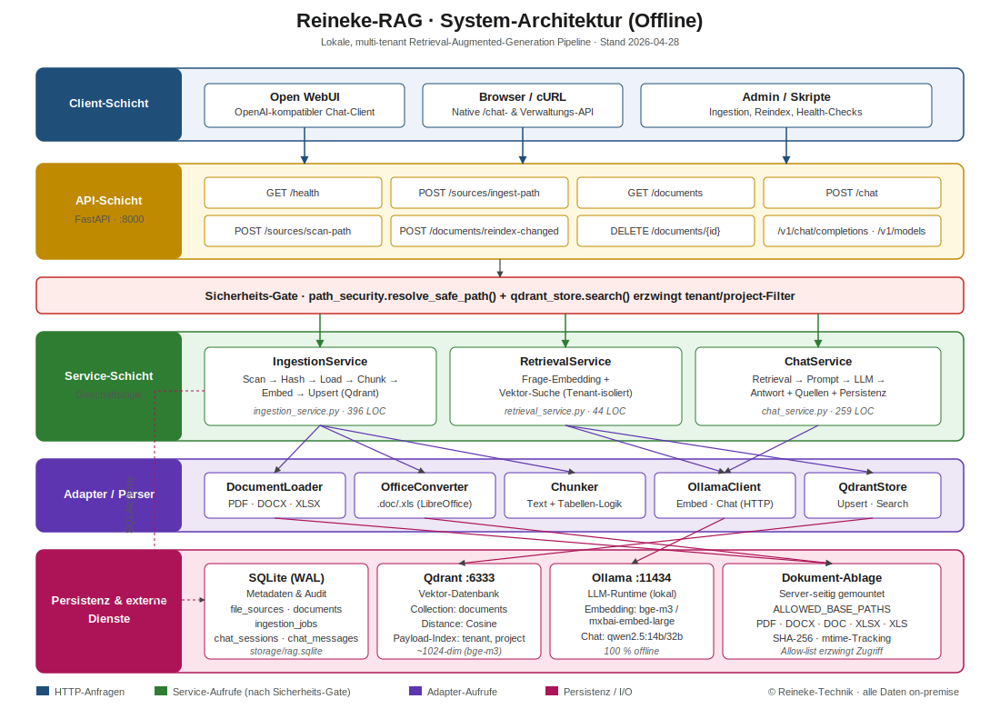

# 1 · Überblick

**Reineke-RAG** ist ein vollständig **offline** betriebenes Retrieval-Augmented-Generation-System
für die Beantwortung natürlich­sprachiger Fragen über interne Dokumente (PDF, Word, Excel —
auch Legacy-Formate `.doc` und `.xls`). Die aktuelle Code­basis liegt unter
`rag-qdrant-local/` und umfasst rund **3.000 Zeilen Python** in einem FastAPI-Backend.

| Eigenschaft | Wert |
|---|---|
| Einsatzart | Server-seitig, vollständig on-premise |
| Internet-Zugriff | nicht erforderlich |
| Quell-Dokumente | Datei­system (kein Upload-Workflow) |
| Unterstützte Formate | PDF, DOCX, DOC, XLSX, XLS |
| Mandanten­fähig | ja (Tenant + Project) |
| Halluzinations­schutz | ja, durch Score-Schwelle und Quellen­zwang |
| LLM-Laufzeit | Ollama (Apple-Silicon-tauglich) |
| Vektor-DB | Qdrant |
| Metadaten-Store | SQLite (WAL-Mode) |
| API-Stil | FastAPI, OpenAPI 3, OpenAI-kompatibel |

Das System ist so konzipiert, dass es ausschließlich auf vom Administrator
freigegebenen Verzeichnis­bäumen arbeitet. Datei-Inhalte verlassen die Maschine nicht.

---

# 2 · Architektur

Das nachfolgende Schema (eine Seite, separat enthalten) zeigt die fünf Schichten —
Client, API, Sicherheits-Gate, Service, Adapter/Parser sowie Persistenz/externe Dienste —
und die Datenflüsse zwischen ihnen.



**Schichten in Kurzform**

1. **Client-Schicht** — Open WebUI, Browser/cURL, Admin-Skripte
2. **API-Schicht** — FastAPI auf Port 8000, native Endpunkte plus OpenAI-Kompatibilität
3. **Sicherheits-Gate** — Pfad-Allow-list und erzwungene Mandanten-Filter
4. **Service-Schicht** — `IngestionService`, `RetrievalService`, `ChatService`
5. **Adapter & Parser** — Dokumenten-Loader, Office-Konverter, Chunker, Ollama-Client, Qdrant-Store
6. **Persistenz & externe Dienste** — SQLite, Qdrant (`:6333`), Ollama (`:11434`), Datei­system

---

# 3 · Technologie-Komponenten

## 3.1 Laufzeit & Frameworks

| Komponente | Version | Zweck |
|---|---|---|
| Python | 3.11 (Container) / 3.12 (Tests) | Programmier­sprache |
| FastAPI | 0.115.0 | HTTP-API, OpenAPI-Spezifikation |
| Uvicorn | 0.30.6 | ASGI-Server |
| Pydantic | 2.9.2 | Datenvalidierung, Schemata |
| pydantic-settings | 2.5.2 | `.env`-Konfiguration |
| python-dotenv | 1.0.1 | Environment-Loader |
| httpx | 0.27.2 | Async HTTP-Client (Ollama) |
| SQLAlchemy | 2.0.36 | ORM für SQLite |
| aiosqlite | 0.20.0 | Async-Treiber |
| qdrant-client | 1.12.1 | Qdrant SDK |
| python-multipart | 0.0.12 | Multipart-Form-Daten |

## 3.2 Dokumenten-Parsing

| Format | Parser | Strategie |
|---|---|---|
| `.pdf` | pypdf 5.0.1 | seitenweise Text-Extraktion, Erkennung Image-only PDFs |
| `.docx` | python-docx 1.1.2 | Paragraphen + Tabellen → Markdown |
| `.xlsx` | openpyxl 3.1.5 | header-erkennend, zeilen­basiertes Chunking |
| `.doc` | LibreOffice (headless) → `.docx` | über `office_converter.py` |
| `.xls` | LibreOffice (headless) → `.xlsx` | über `office_converter.py` |

## 3.3 KI-Komponenten (lokal)

| Aufgabe | Modell-Default | Empfohlen | Dimension |
|---|---|---|---|
| Embedding | `mxbai-embed-large` | **`bge-m3`** (mehrsprachig) | 1024 |
| Chat-Generierung | `qwen2.5:14b` | `qwen2.5:32b-instruct-q4_K_M` | — |

Beide Modelle laufen über **Ollama** (`http://localhost:11434`) — keine Cloud-Anbindung.

## 3.4 Datenhaltung

| Speicher | Pfad / Endpunkt | Zweck |
|---|---|---|
| SQLite | `storage/rag.sqlite` (WAL) | Metadaten, Audit, Chat-Verlauf |
| Qdrant | `http://localhost:6333` | Vektor-Index (Cosine) |
| Datei­system | `ALLOWED_BASE_PATHS` | Original-Dokumente (read-only) |

## 3.5 Container & Deployment

* **Dockerfile** vorhanden (`backend/Dockerfile`) — Python 3.11-slim + LibreOffice + curl.
* Externe Dienste (Qdrant, Ollama) werden als Side-Cars / separate Container betrieben.
* Volumes: `storage/rag.sqlite`, `storage/converted/`, `storage/temp/`.

---

# 4 · Funktionsverzeichnis

Das Backend ist in **17 Python-Module** unter `backend/app/` aufgeteilt. Die folgenden
Tabellen listen sämtliche öffentlichen Funktionen, Klassen und Methoden auf
(strukturiert nach Modul).

## 4.1 `config.py` — Konfiguration

| Symbol | Typ | Zweck |
|---|---|---|
| `Settings` | Klasse | Pydantic-`BaseSettings` mit allen `.env`-Werten |
| `Settings.allowed_base_paths` | Property | Parst `ALLOWED_BASE_PATHS` als `List[Path]` |
| `Settings.sqlite_path` | Property | Aufgelöster Pfad zur SQLite-Datei |
| `Settings.converted_dir` | Property | Verzeichnis für Office-Konvertierungs­ergebnisse |
| `Settings.temp_dir` | Property | Verzeichnis für temporäre Dateien |
| `_project_root() -> Path` | Funktion | Ermittelt Projekt-Root unabhängig vom CWD |
| `get_settings() -> Settings` | Funktion | Cached Singleton (`@lru_cache`) |

## 4.2 `database.py` — SQLite Engine & Sessions

| Symbol | Signatur | Zweck |
|---|---|---|
| `_build_engine()` | `() -> Engine` | Erstellt SQLAlchemy-Engine mit WAL + 30-s-Busy-Timeout |
| `init_db()` | `() -> None` | Erstellt alle Tabellen aus `models.Base.metadata` |
| `session_scope()` | `() -> Iterator[Session]` | Context-Manager mit Commit/Rollback |
| `get_db()` | `() -> Iterator[Session]` | FastAPI-Dependency |

## 4.3 `models.py` — ORM-Klassen

| Klasse | Tabelle | Wichtige Felder |
|---|---|---|
| `FileSource` | `file_sources` | id · tenant · project · base_path · recursive · created_at · last_scan_at · last_ingest_at |
| `Document` | `documents` | id · tenant · project · source_path · file_name · file_extension · file_size · checksum · modified_at · status · chunks_count · error_message · created_at · updated_at |
| `IngestionJob` | `ingestion_jobs` | id · tenant · project · source_path · status · files_found · files_indexed · files_skipped · files_failed · chunks_created · error_message · created_at · completed_at |
| `ChatSession` | `chat_sessions` | id · tenant · project · created_at · messages (1:n) |
| `ChatMessage` | `chat_messages` | id · session_id · role · content · sources_json · created_at |

`Document.status` ∈ {`pending`, `indexed`, `failed`, `deleted`, `requires_ocr`}.

## 4.4 `schemas.py` — Pydantic-DTOs

| Schema | Zweck |
|---|---|
| `TenantProject` | Mixin für `tenant`+`project` |
| `FileEntry` | Datei aus Scan-Resultat |
| `HealthCheckItem`, `HealthResponse` | `/health`-Antwort |
| `ScanPathRequest`, `ScanPathResponse` | `/sources/scan-path` |
| `IngestPathRequest`, `IngestPathResponse`, `IngestError` | `/sources/ingest-path` |
| `ReindexChangedRequest` | `/documents/reindex-changed` |
| `DocumentOut`, `DocumentListResponse` | `GET /documents` |
| `DeleteDocumentResponse` | `DELETE /documents/{id}` |
| `ChatRequest`, `ChatSource`, `ChatResponse` | `/chat` |
| `OpenAIMessage`, `OpenAIChatCompletionRequest`, `OpenAIChatCompletionResponse`, `OpenAIModelEntry`, `OpenAIModelList` | OpenAI-Kompatibilität |

## 4.5 `main.py` — FastAPI-App & Endpunkte

| Endpunkt | Methode | Funktion | Beschreibung |
|---|---|---|---|
| `/health` | GET | `health()` | Pingt Ollama, Qdrant, Modelle |
| `/sources/scan-path` | POST | `sources_scan_path()` | Scannt Verzeichnis ohne zu indexieren |
| `/sources/ingest-path` | POST | `sources_ingest_path()` | Vollständiger Ingest mit Embedding + Upsert |
| `/documents` | GET | `list_documents()` | Listet indizierte Dokumente |
| `/documents/reindex-changed` | POST | `reindex_changed()` | Reindex nur geänderter Dateien |
| `/documents/{document_id}` | DELETE | `delete_document()` | Löscht Dokument + Vektoren |
| `/chat` | POST | `chat_endpoint()` | RAG-Frage/Antwort mit Quellen |
| `/v1/models` | GET | `openai_models()` | OpenAI-kompatible Modell-Liste |
| `/v1/chat/completions` | POST | `openai_chat_completions()` | OpenAI-kompatibler Chat-Endpunkt |

Hilfsfunktionen: `get_ingestion()`, `get_chat()` (Dependency-Injektoren).

## 4.6 `path_security.py` — Pfad-Sicherheit

| Symbol | Signatur | Zweck |
|---|---|---|
| `PathSecurityError` | Exception | Eingabe nicht erlaubt |
| `_is_within(child, parent)` | `(Path, Path) -> bool` | Prüft Eltern-Beziehung |
| `_is_under_system_deny(path, allowed_bases)` | `(Path, List[Path]) -> bool` | Schutz vor `/etc`, `/root` etc. |
| `get_allowed_base_paths()` | `() -> List[Path]` | Liest und validiert `ALLOWED_BASE_PATHS` |
| `resolve_safe_path(user_input)` | `(str) -> Path` | **Hauptfunktion**: kanonisiert + prüft |
| `assert_existing_dir(path)` | `(Path) -> Path` | Prüft Existenz und Verzeichnis-Typ |

System-Deny-Liste (Default): `/etc`, `/root`, `/home`, `/var`, `/proc`, `/sys`, `/dev`, `/boot`, `/usr`, `/bin`, `/sbin`, `/lib`, `/opt`.

## 4.7 `source_scanner.py` — Datei-Scanner

| Symbol | Signatur | Zweck |
|---|---|---|
| `SUPPORTED_EXTENSIONS` | Konstante | `{.pdf, .docx, .doc, .xlsx, .xls}` |
| `_IGNORED_DIR_NAMES` | Konstante | `.git`, `__pycache__`, `node_modules`, … |
| `ScanResult` | Dataclass | Felder: `supported`, `unsupported`, `file_types` |
| `_iter_files(root, recursive)` | Iterator | Datei-Iteration mit Ignore-Liste |
| `_is_in_ignored_dir(p)` | `(Path) -> bool` | True, falls Ordner ignoriert |
| `_classify(path)` | `(Path) -> tuple[bool, str]` | (unterstützt?, Endung) |
| `scan_directory(root, *, recursive=True)` | `(Path) -> ScanResult` | **Haupt­funktion** |

## 4.8 `document_loader.py` — Dokumenten-Parsing

| Symbol | Signatur | Zweck |
|---|---|---|
| `DocumentLoadError` | Exception | Allgemeiner Lade-Fehler |
| `RequiresOCRError` | Exception | PDF ohne Text-Layer (Bild-PDF) |
| `LoadedSegment` | Dataclass | Ein Textblock + Metadaten |
| `LoadedDocument` | Dataclass | Sammlung aller Segmente eines Dokuments |
| `_load_pdf(path)` | `(Path) -> List[LoadedSegment]` | Seitenweises Extrahieren |
| `_table_to_markdown(table)` | `(table) -> str` | Word-Tabelle als Markdown |
| `_load_docx(path)` | `(Path) -> List[LoadedSegment]` | Paragraphen + Tabellen |
| `_load_xlsx(path)` | `(Path) -> List[LoadedSegment]` | Sheet-Erkennung, Header-Heuristik |
| `load_document(path)` | `(Path) -> LoadedDocument` | **Dispatcher** für alle Formate |

## 4.9 `office_converter.py` — Legacy-Office-Konvertierung

| Symbol | Signatur | Zweck |
|---|---|---|
| `OfficeConversionError` | Exception | LibreOffice-Fehler / fehlt |
| `libreoffice_available()` | `() -> bool` | Prüft `soffice` im PATH |
| `_run_soffice(src, target_format, outdir)` | `(Path, str, Path) -> Path` | Subprocess-Wrapper, 180 s Timeout |
| `convert_doc_to_docx(src, outdir=None)` | `(Path) -> Path` | `.doc` → `.docx` |
| `convert_xls_to_xlsx(src, outdir=None)` | `(Path) -> Path` | `.xls` → `.xlsx` |

## 4.10 `chunker.py` — Chunking-Strategien

| Symbol | Signatur | Zweck |
|---|---|---|
| `Chunk` | Dataclass | Embed-fähiger Textblock + Metadaten |
| `_split_paragraphs(text)` | `(str) -> List[str]` | Trennung an Leerzeilen |
| `_split_long_paragraph(p, size)` | `(str, int) -> List[str]` | Satz-bewusster Hard-Wrap |
| `_chunk_text(text, size, overlap)` | `(str, int, int) -> List[str]` | Sliding Window |
| `_chunk_text_segment(seg, start_index)` | `(LoadedSegment, int) -> List[Chunk]` | Wrapper für Text-Segmente |
| `_xlsx_rows_per_chunk(num_columns)` | `(int) -> int` | Adaptive Block-Größe |
| `_chunk_spreadsheet_segment(seg, start_index)` | `(LoadedSegment, int) -> List[Chunk]` | Tabellen-Chunks (Header wiederholt) |
| `chunk_document(doc)` | `(LoadedDocument) -> List[Chunk]` | **Dispatcher** |

Default-Werte: `CHUNK_SIZE=1000`, `CHUNK_OVERLAP=150`, `XLSX_ROWS_PER_CHUNK=40`,
`XLSX_MAX_CHARS_PER_CHUNK=6000`.

## 4.11 `ollama_client.py` — LLM-Client

| Methode | Signatur | Zweck |
|---|---|---|
| `OllamaError` | Exception | API- oder Netzwerk-Fehler |
| `OllamaClient.__init__(base_url=None, timeout=120.0)` | Konstruktor | DI über Settings |
| `_request(method, path, *, json=None)` | async | Low-level HTTP |
| `list_models()` | `() -> List[str]` | `GET /api/tags` |
| `has_model(name)` | `(str) -> bool` | Prefix-Match |
| `embed(text, *, model=None)` | `(str) -> List[float]` | `POST /api/embeddings` |
| `embed_many(texts, *, model=None)` | `(List[str]) -> List[List[float]]` | Sequenzielle Calls |
| `chat(messages, *, model=None, temperature=None, max_tokens=None)` | `(...) -> str` | `POST /api/chat` |
| `ping()` | `() -> bool` | Health-Probe |

## 4.12 `qdrant_store.py` — Vektor-Store

| Methode | Signatur | Zweck |
|---|---|---|
| `QdrantStoreError` | Exception | Inkonsistenter Aufruf / API-Fehler |
| `SearchHit` | Dataclass | `score`, `payload`, `point_id` |
| `QdrantStore.__init__(url=None, api_key=None, collection=None)` | Konstruktor | DI über Settings |
| `ping()` | `() -> bool` | Erreichbarkeit |
| `ensure_collection(vector_size)` | `(int) -> None` | Erstellt oder prüft Collection (Cosine) |
| `_ensure_payload_indexes()` | `() -> None` | Idempotente Index-Erstellung (tenant, project, …) |
| `upsert_chunks(*, document_id, vectors, payloads)` | `(...) -> int` | Schreibt Punkte (Wait=True) |
| `delete_document(document_id)` | `(str) -> int` | Löscht alle Punkte eines Dokuments |
| `search(*, tenant, project, query_vector, top_k, score_threshold=None)` | `(...) -> List[SearchHit]` | **Pflicht-Filter**: tenant + project, sonst Exception |

## 4.13 `ingestion_service.py` — Ingest-Pipeline

| Methode | Signatur | Zweck |
|---|---|---|
| `IngestionService.__init__(ollama=None, store=None)` | Konstruktor | DI |
| `_ensure_collection_for_model()` | async | Probt Embedding-Dimension, erstellt Collection |
| `_upsert_file_source(db, *, tenant, project, base_path, recursive)` | sync | Legt/aktualisiert `FileSource`-Datensatz |
| `_find_or_create_document(db, *, tenant, project, path, checksum)` | sync | (Document, is_new) |
| `ingest_path(db, *, tenant, project, path, recursive=True, reindex_changed_only=True)` | async | **Komplette Pipeline** |
| `reindex_changed(db, *, tenant, project, path, recursive=True, mark_missing_as_deleted=False)` | async | Differenz-Reindex |
| `delete_document(db, document_id)` | async | Qdrant + SQLite löschen |

## 4.14 `retrieval_service.py` — Suche

| Methode | Signatur | Zweck |
|---|---|---|
| `RetrievalService.__init__(ollama=None, store=None)` | Konstruktor | DI |
| `retrieve(*, tenant, project, question, top_k=None, min_score=None)` | async, `() -> List[SearchHit]` | Embedding + Qdrant-Suche mit Mandanten-Filter |

## 4.15 `chat_service.py` — Chat-Orchestrierung

| Methode | Signatur | Zweck |
|---|---|---|
| `SYSTEM_PROMPT` | Konstante | Deutsche RAG-Anweisung |
| `NO_CONTEXT_ANSWER` | Konstante | Fallback bei 0 Treffern |
| `ChatService.__init__(retrieval=None, ollama=None, session_factory=None)` | Konstruktor | DI |
| `_resolve_session_id(*, tenant, project, session_id=None)` | sync | DB-Phase A: Session laden/anlegen |
| `_persist_messages(*, session_id, question, answer, sources)` | sync | DB-Phase C: Messages persistieren |
| `_build_context(hits)` static | `(...) -> str` | Quellen­block aufbauen |
| `_hits_to_sources(hits)` static | `(...) -> List[ChatSource]` | DTO-Konversion |
| `chat(*, tenant, project, question, session_id=None, top_k=None)` | async, `() -> ChatResponse` | **Haupt­methode** |

## 4.16 `openai_compat.py` — OpenAI-Adapter

| Methode | Signatur | Zweck |
|---|---|---|
| `OpenAIRequestError` | Exception | Anfrage nicht mappbar |
| `ResolvedRequest` | Dataclass | tenant, project, question, session_id, model |
| `_last_user_message(messages)` | sync | Extrahiert letzte User-Nachricht |
| `_parse_model_id(model)` | `(str) -> Optional[tuple]` | `rag:tenant:project` parsen |
| `_coerce_str(value)` | sync | Type-Coercion |
| `resolve_openai_request(req)` | `(...) -> ResolvedRequest` | Mapping inkl. `extra_body` |
| `build_openai_response(*, model, answer, sources, session_id)` | `(...) -> OpenAIChatCompletionResponse` | Antwort-Aufbau |

## 4.17 `utils.py` — Hilfsfunktionen

| Funktion | Signatur | Zweck |
|---|---|---|
| `configure_logging()` | `() -> None` | Initialisiert Logging laut `LOG_LEVEL` |
| `get_logger(name)` | `(str) -> Logger` | Wrapper |
| `new_id()` | `() -> str` | UUID4 |
| `utcnow_iso()` | `() -> str` | ISO-8601-Zeitstempel |
| `deterministic_uuid(*parts)` | `(...) -> str` | UUID5 (für Chunk-Point-IDs) |
| `sha256_file(path, *, chunk_size=1MB)` | `(Path) -> str` | Stream-Hash |
| `file_modified_iso(path)` | `(Path) -> str` | mtime als ISO |
| `chunked(items, n)` | `(...) -> Iterator` | Batch-Iterator |

---

# 5 · HTTP-API im Detail

## 5.1 Native Endpunkte

### `GET /health`
Liefert Status-Items (`backend`, `ollama`, `qdrant`, `embedding_model`, `chat_model`).
Antwort enthält pro Item `{name, ok, detail}`.

### `POST /sources/scan-path`
Body: `{tenant, project, path, recursive?}`
Antwort enthält `supported`, `unsupported`, `file_types`. Indexiert **nichts**.

### `POST /sources/ingest-path`
Body: `{tenant, project, path, recursive?, reindex_changed_only?}`
Komplette Pipeline. Antwort: `{job_id, indexed_files, failed_files, chunks_created, errors[]}`.

### `GET /documents?tenant=…&project=…&include_deleted=false`
Listet alle Dokumente eines Mandanten/Projekts mit Status und Chunk-Anzahl.

### `POST /documents/reindex-changed`
Wie `ingest-path`, jedoch ohne neue Dateien — nur geänderte werden re-embedded.
Optional `mark_missing_as_deleted=true` markiert verschwundene Dokumente.

### `DELETE /documents/{document_id}`
Löscht alle zugehörigen Qdrant-Punkte und den SQLite-Eintrag.

### `POST /chat`
Body: `{tenant, project, question, session_id?, top_k?}`
Antwort: `{answer, sources[], session_id}`.
* Wenn keine Quellen über Schwelle → Antwort = `NO_CONTEXT_ANSWER`,
  LLM wird **nicht** aufgerufen.

## 5.2 OpenAI-kompatible Endpunkte

### `GET /v1/models`
Listet virtuelle Modelle in der Form `rag:<tenant>:<project>` (oder `rag:default`).

### `POST /v1/chat/completions`
Akzeptiert OpenAI-Standard. Tenant/Projekt werden bestimmt aus
1. Inline-Feldern, 2. `extra_body`, 3. Modell-ID `rag:tenant:project`.
Streaming wird abgelehnt (`stream=true` ⇒ Fehler).

## 5.3 Fehler-Klassen

| HTTP | Auslöser |
|---|---|
| 400 | `PathSecurityError`, `OpenAIRequestError`, `ValueError` |
| 404 | Dokument nicht gefunden |
| 500 | `QdrantStoreError`, allgemeiner Fehler |
| 502 | `OllamaError` (LLM nicht erreichbar) |

---

# 6 · Datenflüsse

## 6.1 Ingest-Pipeline

1. `POST /sources/ingest-path` → Pfad-Sicherheits-Gate.
2. `IngestionService.ingest_path()` öffnet Qdrant-Collection (Dimension passend zum Embedding-Modell).
3. `scan_directory()` liefert alle unterstützten Dateien.
4. Pro Datei:
   * `sha256_file()` berechnet Prüfsumme.
   * Bei unverändertem Hash und Status `indexed` → Skip.
   * `load_document()` extrahiert Segmente.
   * `chunk_document()` erzeugt Chunks (Text- oder Tabellen-Strategie).
   * `OllamaClient.embed_many()` liefert Vektoren.
   * `QdrantStore.upsert_chunks()` schreibt Punkte mit Tenant/Projekt-Payload.
   * SQLite-Status auf `indexed` (oder `failed`/`requires_ocr`).
5. Antwort enthält Job-Statistik und Fehlerliste.

## 6.2 Chat-Pipeline

1. `POST /chat` (oder `/v1/chat/completions`).
2. `_resolve_session_id()` lädt oder legt eine `ChatSession` an.
3. `RetrievalService.retrieve()` erzeugt Frage-Embedding und ruft
   `QdrantStore.search()` mit erzwungenem Tenant/Projekt-Filter und Score-Schwelle auf.
4. Bei **0 Treffern** → `NO_CONTEXT_ANSWER`, Persistierung, Rückgabe.
5. Sonst: `_build_context()` erzeugt nummerierten Quellenblock,
   `OllamaClient.chat()` generiert Antwort.
6. `_persist_messages()` speichert User- und Assistant-Message inkl. `sources_json`.
7. Antwort: `{answer, sources, session_id}`.

## 6.3 Externe Service-Abhängigkeiten

| Quelle | Ziel | Protokoll | Zweck |
|---|---|---|---|
| Backend | Ollama (`:11434`) | HTTP | Embeddings, Chat |
| Backend | Qdrant (`:6333`) | HTTP | Upsert, Suche |
| Backend | Datei­system | POSIX | Originaldokumente lesen |
| Backend | LibreOffice (Subprozess) | CLI | Legacy-Konvertierung |

---

# 7 · Datenmodell

## 7.1 SQLite-Schema (5 Tabellen)

| Tabelle | Schlüssel | Zweck |
|---|---|---|
| `file_sources` | id | Konfigurierte Wurzel­pfade pro Mandant |
| `documents` | id (UNIQUE: tenant, project, source_path) | Indizierte Dateien |
| `ingestion_jobs` | id | Audit-Trail aller Ingest-Läufe |
| `chat_sessions` | id | Konversations­container |
| `chat_messages` | id (FK: session_id) | Einzelne Nachrichten + Quellen |

WAL-Mode, `foreign_keys=ON`, `synchronous=NORMAL`, `busy_timeout=30 s`.

## 7.2 Qdrant-Punktformat

```
{
  id      : UUID5(document_id, chunk_index),
  vector  : [float × dim],
  payload : {
      tenant, project, document_id, file_name,
      file_extension, source_path, checksum, modified_at,
      document_type, chunk_index, page?, sheet?,
      row_start?, row_end?, text
  }
}
```

Indexierte Payload-Felder: `tenant`, `project`, `document_id`, `file_extension`.

---

# 8 · Konfiguration (`.env`)

| Variable | Default | Beschreibung |
|---|---|---|
| `OLLAMA_BASE_URL` | `http://localhost:11434` | LLM-Endpunkt |
| `QDRANT_URL` | `http://localhost:6333` | Vektor-DB |
| `QDRANT_API_KEY` | — | Optional |
| `QDRANT_COLLECTION` | `documents` | Collection-Name |
| `EMBEDDING_MODEL` | `mxbai-embed-large` | Empfohlen: `bge-m3` |
| `CHAT_MODEL` | `qwen2.5:14b` | Größere Modelle möglich |
| `ALLOWED_BASE_PATHS` | — | **Pflicht** — komma­separierte absolute Pfade |
| `SQLITE_DB_PATH` | `./storage/rag.sqlite` | Metadaten-DB |
| `CHUNK_SIZE` | `1000` | Zeichen pro Text-Chunk |
| `CHUNK_OVERLAP` | `150` | Überlappung |
| `XLSX_ROWS_PER_CHUNK` | `40` | Zeilen pro Tabellen-Chunk |
| `XLSX_MAX_CHARS_PER_CHUNK` | `6000` | Hardlimit |
| `RETRIEVAL_TOP_K` | `6` | Anzahl Treffer |
| `MIN_RETRIEVAL_SCORE` | `0.35` | Schwelle für „relevant“ |
| `CHAT_TEMPERATURE` | `0.1` | Sampling |
| `CHAT_MAX_TOKENS` | `1024` | Max. Antwort­länge |
| `SOFFICE_BIN` | `soffice` | LibreOffice-Binary |
| `HOST` | `0.0.0.0` | FastAPI |
| `PORT` | `8000` | FastAPI |
| `LOG_LEVEL` | `INFO` | DEBUG/INFO/WARN/ERROR |

---

# 9 · Sicherheits-Eigenschaften

1. **Allow-list-basierter Datei­zugriff.** Ohne `ALLOWED_BASE_PATHS` lehnt das System
   jede Scan- oder Ingest-Anfrage ab.
2. **Pfad-Traversal-Schutz.** `resolve_safe_path()` kanonisiert mit `Path.resolve()`,
   prüft Eltern-Beziehung, lehnt System­verzeichnisse (`/etc`, `/root`, …) ab,
   sofern diese nicht explizit freigegeben sind.
3. **Mandanten-Isolation als Pflicht-Filter.** `QdrantStore.search()` wirft
   `QdrantStoreError`, wenn `tenant` oder `project` leer sind — eine
   ungefilterte Vektor-Suche ist nicht möglich.
4. **Anti-Halluzination.** Ohne Treffer über `MIN_RETRIEVAL_SCORE` gibt das
   System die Konstante `NO_CONTEXT_ANSWER` zurück; das LLM wird in diesem
   Fall **nicht** angefragt.
5. **Quellen­zwang.** Jede generierte Antwort wird mit `sources` (Datei,
   Seite/Sheet/Zeilenbereich, Score) ausgeliefert und persistiert.
6. **Offline-Betrieb.** Sämtliche Modelle laufen lokal über Ollama;
   das Backend macht keine ausgehenden Verbindungen außer zu Qdrant und Ollama.
7. **Read-only auf Originale.** Ingest-Pipeline schreibt nicht in die
   Quell­verzeichnisse. Konvertierungs­ergebnisse landen in `storage/converted/`.

---

# 10 · Tests

Test-Verzeichnis: `backend/tests/` (8 Module). Auführung:

```
cd backend
pytest -v
```

| Test­datei | Fokus |
|---|---|
| `test_path_security.py` | Allow-list, Traversal, System-Pfad-Ablehnung |
| `test_source_scanner.py` | Klassifikation, Recursive-Flag |
| `test_extractors.py` | PDF/DOCX/XLSX-Parsing |
| `test_chunker_xlsx.py` | XLSX-Chunking inklusive Header-Wiederholung |
| `test_qdrant_filter.py` | Pflicht-Filter Tenant + Projekt |
| `test_openai_compat.py` | OpenAI-Request-Auflösung |
| `test_chat_no_hits.py` | Fallback bei fehlenden Treffern (async) |
| `conftest.py` | Fixtures (Sandbox, Env) |

End-to-End-Bericht (`TEST_REPORT.md`, 28. April 2026):
* Korpus 61 Dateien, 767 Chunks, 0 Fehler nach Wechsel auf `bge-m3`.
* Alle 4 Test-Fragen liefern entweder konsistenten Fallback oder präzise Antwort
  mit korrekter Quellen­angabe.

---

# 11 · Deployment

## 11.1 Voraussetzungen

* Ollama ≥ 0.3 lokal laufend (Modelle vorgepullt: `bge-m3`, `qwen2.5:14b` o. ä.).
* Qdrant ≥ 1.17 erreichbar.
* LibreOffice (für `.doc`/`.xls`) — optional, falls Legacy-Formate vorkommen.

## 11.2 Schnellstart

```bash
git clone <repo>
cd rag-qdrant-local
cp .env.example .env
# In .env: ALLOWED_BASE_PATHS=/srv/dokumente,/mnt/policies   ← anpassen

cd backend
python -m venv .venv
source .venv/bin/activate
pip install -r requirements.txt

uvicorn app.main:app --host 0.0.0.0 --port 8000
```

## 11.3 Beispiel-Workflow

```
# 1. Health-Check
curl http://localhost:8000/health

# 2. Scan
curl -X POST http://localhost:8000/sources/scan-path \
  -H "Content-Type: application/json" \
  -d '{"tenant":"reineke","project":"watch","path":"/srv/dokumente/watch"}'

# 3. Ingest
curl -X POST http://localhost:8000/sources/ingest-path \
  -H "Content-Type: application/json" \
  -d '{"tenant":"reineke","project":"watch","path":"/srv/dokumente/watch"}'

# 4. Frage stellen
curl -X POST http://localhost:8000/chat \
  -H "Content-Type: application/json" \
  -d '{"tenant":"reineke","project":"watch","question":"Welche Passwortregeln gelten?"}'
```

## 11.4 Open-WebUI-Integration

* In Open WebUI als „OpenAI-API“ eintragen, Base-URL = `http://<backend>:8000/v1`.
* Modell wählen: `rag:reineke:watch` (Format `rag:<tenant>:<project>`).
* Chat verwendet automatisch den RAG-Pfad.

## 11.5 Wartung

| Aktion | Befehl |
|---|---|
| Reindex geänderter Dateien | `POST /documents/reindex-changed` |
| Verschwundene Dateien als „deleted“ | `…?mark_missing_as_deleted=true` |
| Einzelnes Dokument entfernen | `DELETE /documents/{id}` |
| SQLite-Backup | `sqlite3 storage/rag.sqlite ".backup backup.sqlite"` |
| Qdrant-Snapshot | `curl -X POST http://localhost:6333/collections/documents/snapshots` |

---

# 12 · Status & nächste Schritte

* **Reife.** End-to-End funktionsfähig, Test-Bericht 2026-04-28 grün.
* **Empfohlene Nachjustierung.**
  * Default-Embedder in `.env.example` von `mxbai-embed-large` auf
    `bge-m3` umstellen (besser für deutsche Texte und große XLSX-Chunks).
  * Datei­namen optional ins Embedding aufnehmen (für name-zentrierte Fragen).
  * Tabelleninhalte aus Word/PDF mit erhöhtem Overlap oder dediziertem
    Tabellen-Chunker indizieren.
* **Skalierung.** SQLite-Setup (Busy-Timeout 30 s, WAL) ist für moderate
  Parallel­last (≤ 10 gleichzeitige Chats) ausgelegt; bei höherer Last
  Migration auf PostgreSQL.

---

*Diese Dokumentation wurde automatisiert aus der Code­basis
`rag-qdrant-local/` (3.036 Python-Zeilen, 17 Module, 9 HTTP-Endpunkte)
generiert. Für Detail­fragen siehe Inline-Docstrings und `TEST_REPORT.md`.*
